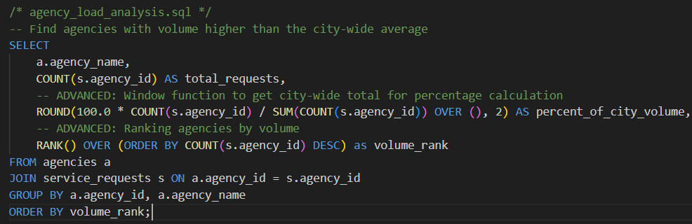
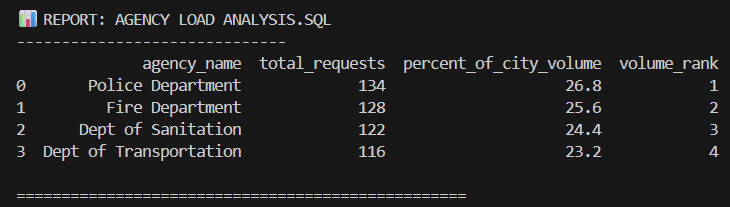

📊 Database Schema: City Agency Performance 

A relational SQLite database modeled to simulate a municipal service request system.
* 1 of 3 demo queries is shown below, see the queries folder for more query examples

### Table Relationships
1. agencies (Dimension Table)
   * agency_id (Primary Key): Unique identifier for each city department
   * agency: Short-code (e.g., 'NYPD')
   * agency_name: Full descriptive name

2. service_requests (Fact Table)
   * request_id: Primary Key
   * agency_id (Foreign Key): Links to the agencies table
   * created_date: The date the ticket was opened
   * closed_date: The date the ticket was resolved
   * status: The current state of the request (e.g., 'Closed', 'Pending')
  

